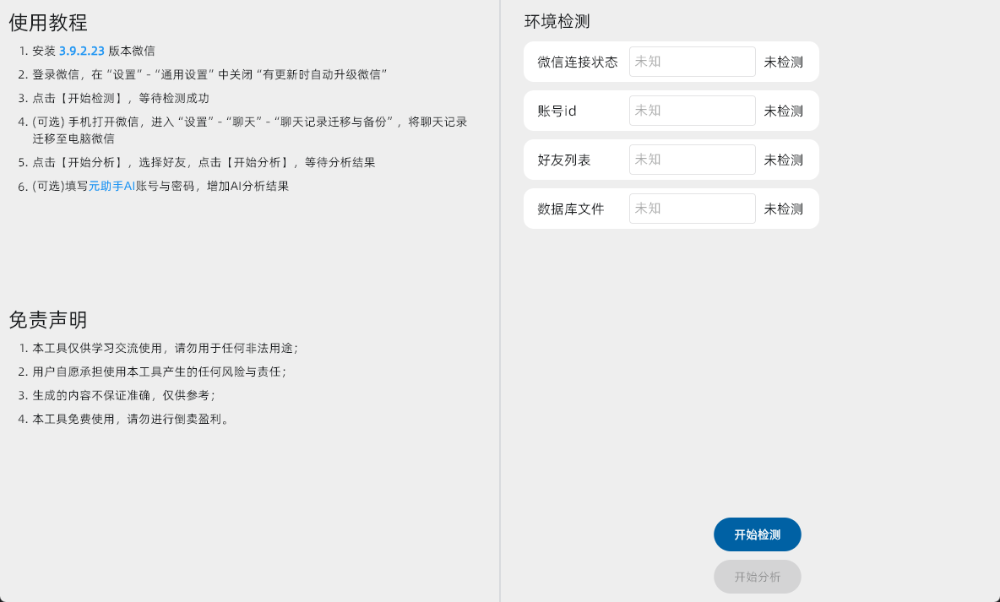
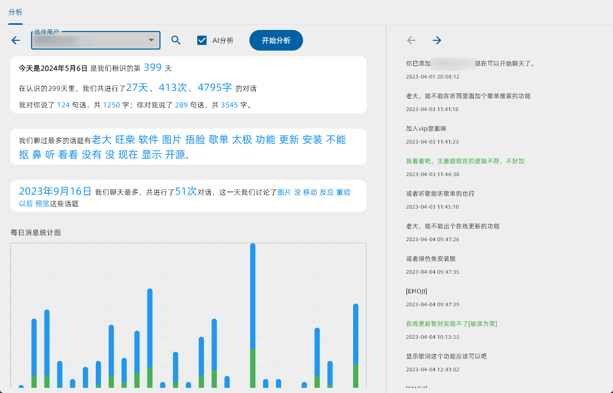
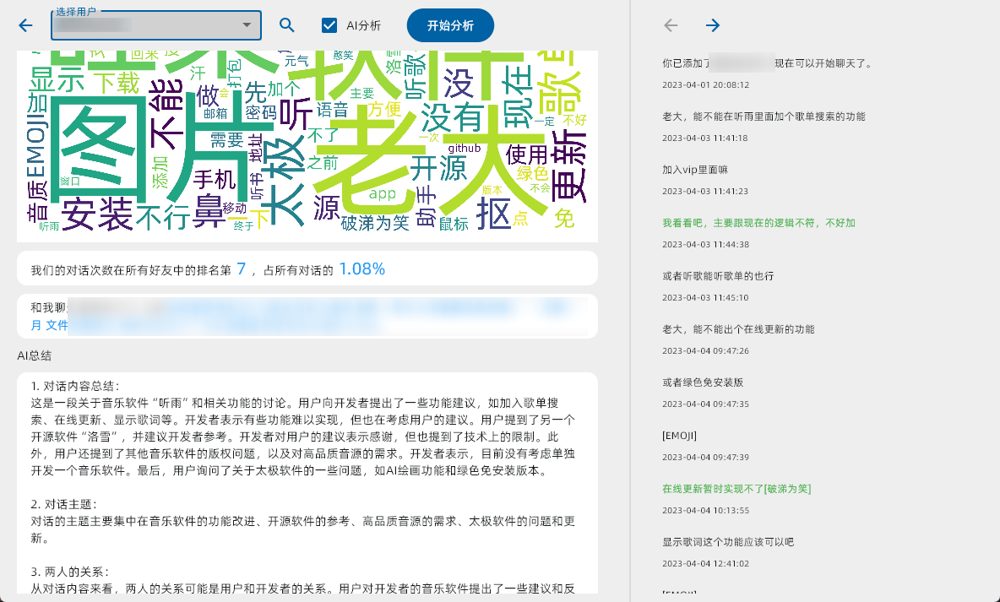

# wxChatAnalysis

微信对话分析，可以分析你的微信聊天记录，生成聊天记录的词云图，以及聊天记录的词频统计图等。

### 运行环境

python3.10

### 运行方法

1. 下载项目
2. 安装依赖

```
pip install -r requirements.txt
```

3. 运行程序

```
python main.py
```

### 截图





### 感谢

[WeChatFerry](https://github.com/lich0821/WeChatFerry)

[flet](https://github.com/flet-dev/flet)
